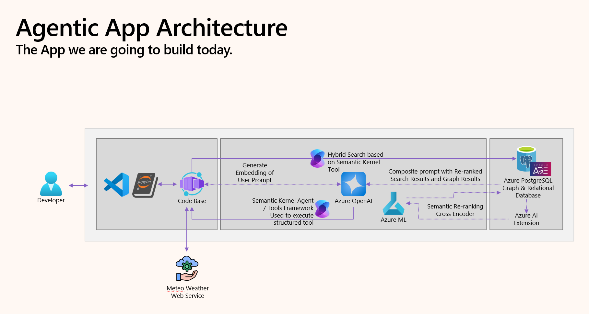

<p>

</p>

# [Microsoft Ignite 2025](https://ignite.microsoft.com)

## 🔥LAB515: Build advanced AI Agents with PostgreSQL

[](https://discord.com/invite/ByRwuEEgH4)
[](https://aka.ms/foundry/forum)

### 🧠 Session Description

In this hands-on lab, you’ll build an AI-powered legal research assistant that reasons over real-world case law data using PostgreSQL and Microsoft Agent Framework.
You’ll learn how to combine retrieval-augmented generation (RAG), vector search, and graph intelligence to develop an agentic workflow capable of generating accurate, contextual, and explainable answers — all running on Azure Database for PostgreSQL.

### 💡 Learning Outcomes

By the end of this lab, you will be able to:

- Configure Azure Database for PostgreSQL Flexible Server with AI extensions (`azure_ai`, `pgvector`, `diskann`, and `apache_age`)
- Use Microsoft Agent Framework to build autonomous agents with database and web plugins
- Implement semantic search and reranking using vector embeddings
- Enhance reasoning quality using the GraphRAG pattern
- Deploy your AI agent and supporting infrastructure on Azure using Bicep and CLI automation

### 💻 Technologies Used

1. Azure Database for PostgreSQL Flexible Server (with AI extensions)
1. Microsoft Agent Framework (for agent orchestration)
1. Azure OpenAI Service (embeddings + LLM completions)
1. Python (agent runtime and notebook execution)
1. Apache `AGE` (for graph storage and reasoning)
1. `DiskANN` (for fast approximate vector similarity search)
1. VS Code PostgreSQL Extension (for hands-on queries and debugging)

### 🏗️ Architecture

```mathematica
 User Query → Microsoft Agent Framework → PostgreSQL (Vector + Graph + AI) → Azure OpenAI → Contextual Answer
```


- Microsoft Agent Framework: Handles reasoning, plugin invocation, and dialogue context.
- PostgreSQL: Stores case law data, embeddings, and graph relationships.
- GraphRAG: Uses Apache AGE to connect related entities and improve recall.
- Azure OpenAI: Powers embeddings and completion for semantic responses.

### Lab Sections

1. **Setup Azure PostgreSQL Database**:
   - Database connection and configuration
   - Install the `azure_ai` extension
   - Configure Azure OpenAI connectivity

2. **Using AI-driven features in PostgreSQL**:
   - Pattern matching queries
   - Semantic vector search using embeddings
   - DiskANN indexing for fast vector similarity search

3. **Building the Agent Application**:
   - Setting up Microsoft Agent Framework
   - Creating database search plugins
   - Implementing semantic reranking
   - Adding external data sources
   - Testing and improving the agent

### 📘 Lab Structure

|Folder                |Description                                               |
|----------------------|----------------------------------------------------------|
|`Code/`                 |Core Jupyter notebooks and sample scripts               |
|`Dataset/`              |Sample dataset (cases.csv) for legal research queries   |
|`Scripts/`              |Source code for agents, plugins, and database connectors|
|`Docs/`                 |Step-by-step lab manual and architecture guide          |
|`Docs/images`           |Architecture and concept diagrams                       |
|`.devcontainer/`        |Preconfigured environment for VS Code                   |
|`infra/`                |Deployment templates (Bicep + PowerShell scripts)       |

### 🚀 Getting Started

#### 1️⃣ Setup Environment

- Ensure you have an Azure subscription with access to Azure OpenAI.
- Install required CLI tools:

```bash
azd auth login
azd env new
azd provision
```
This will deploy the Azure resources (PostgreSQL + OpenAI) and generate a `.env` file containing connection details.

#### 2️⃣ Configure Database

Use the provided scripts in Scripts/ to:
    - Initialize tables and vector indexes
    - Load the sample case law dataset
    - Enable `azure_ai`, `pgvector`, and `apache_age` extensions

#### 3️⃣ Run the Lab Notebook

Open `Code/lab.ipynb` in Visual Studio Code and follow the guided steps to:

- Connect to your database
- Generate embeddings
- Execute semantic and graph-based queries
- Interact with your AI Agent

### 📚 Resources and Next Steps

|Resource                |Link                                |Description                                    |
|------------------------|------------------------------------|-----------------------------------------------|
|Ignite 2025 Next Steps  |[https://aka.ms/Ignite25-Next-Steps](https://aka.ms/Ignite25-Next-Steps?ocid=ignite25_nextsteps_cnl)  |Links to all repos for Ignite 2025 Sessions   |
|Azure AI Foundry Discord|https://aka.ms/azureaifoundrydiscord|Connect with the Azure AI Foundry team         |
|Learn at Ignite         |https://aka.ms/LearnAtIgnite        |Continue learning on Microsoft Learn           |
|GraphRAG for PostgreSQL |aka.ms/GraphRAG-PG                  |Learn how to add graph intelligence to Postgres|

## Content Owners

<table>
<tr>
    <td align="center"><a href="https://github.com/varun-dhawan">
        <br />
        <sub><b>Varun Dhawan</b></sub>
    </a><br />
        <a href="https://github.com/varun-dhawan" title="talk">📢</a> 
    </td>
    <td align="center"><a href="https://github.com/jjfrost">
        <br />
        <sub><b>Jonathon Frost</b></sub>
    </a><br />
        <a href="https://github.com/jjfrost" title="talk">📢</a> 
    </td>
    <td align="center"><a href="https://github.com/JaredMSFT">
        <br />
        <sub><b>Jared Meade</b></sub>
    </a><br />
        <a href="https://github.com/JaredMSFT" title="talk">📢</a> 
    </td>
    <td align="center"><a href="https://github.com/gaurikasar">
        <br />
        <sub><b>Gauri Kasar</b></sub>
    </a><br />
        <a href="https://github.com/gaurikasar" title="talk">📢</a> 
    </td>
</tr>
</table>


## Contributing

This project welcomes contributions and suggestions.  Most contributions require you to agree to a
Contributor License Agreement (CLA) declaring that you have the right to, and actually do, grant us
the rights to use your contribution. For details, visit [Contributor License Agreements](https://cla.opensource.microsoft.com).

When you submit a pull request, a CLA bot will automatically determine whether you need to provide
a CLA and decorate the PR appropriately (e.g., status check, comment). Simply follow the instructions
provided by the bot. You will only need to do this once across all repos using our CLA.

This project has adopted the [Microsoft Open Source Code of Conduct](https://opensource.microsoft.com/codeofconduct/).
For more information see the [Code of Conduct FAQ](https://opensource.microsoft.com/codeofconduct/faq/) or
contact [opencode@microsoft.com](mailto:opencode@microsoft.com) with any additional questions or comments.


This project may contain trademarks or logos for projects, products, or services. Authorized use of Microsoft
trademarks or logos is subject to and must follow
[Microsoft's Trademark & Brand Guidelines](https://www.microsoft.com/legal/intellectualproperty/trademarks/usage/general).
Use of Microsoft trademarks or logos in modified versions of this project must not cause confusion or imply Microsoft sponsorship.
Any use of third-party trademarks or logos are subject to those third-party's policies.
